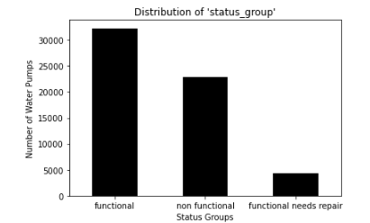

# Overview: 

This project analyzes data from Taarifa and the Tanzanian Ministry of Water to find which water pumps are in need of repair. This is an imbalanced class problem, with three possible classes, “functional”, “non functional”, and “functional in need of repair”. The goal was accuracy, and with the OSEMN method and iterative modeling, I was able to obtain an accuracy score of 0.7525 with the help of a Random Forest Classifier. 
 
 

# Business Case: 

Find the best model fit to accurately predict which water pumps are functional, non functional, or functional in need of repair. 

# Data:

The data used in this project is from Taarifa and the Tanzanian Ministry of Water. I was able to obtain this data and the problem from DrivenData as it is part of an ongoing project, Pump it Up: Data Mining the Water Table. The dataset contains 41 columns with 59,400 rows. 

# Methods:

The methods used for the project were based on the OSEMN method as well as forward selection and iterative modeling. For the modeling portion, I used LogisticRegression, DecisionTreeClassifier, and RandomForestClassifer taken from the Sci-kit Learn library.

# Findings:

The data contained mostly categorical columns and only about a quarter of numerical columns. For this reason, I decided to create my first iteration of models with just the numerical columns. From there I would view which columns were having the most impact with feature importance, and choose the next categorical columns based on that. With this strategy, I used all the numerical columns and the categorical columns, "basin", "region", and "extraction_type_class". For each of the categorical columns, I used pd.get_dummies. Two of the numerical columns, "construction_year", and "gps_height", had over 18,000 zero values. As I did not want this to negatively affect the overall accuracy, I decided to change the zeros to the columns' median value. 

# Conclusions + Future Work:

From the above-mentioned methods, I was able to obtain an overall accuracy score of 0.7525 using the RandomForestClassifer with the arguments, max_depth = 20 and random_state = 11 (for consistency). This was the score I received when adding it to the DrivenData website and with this score, I also came out with being 4,562 out of 14,115 other competitors, putting me in the top 32% as of the time of writing this README. 

# For more information:

​​See the full analysis in the [Jupyter Notebook](https://github.com/Marissa841/phase_3_project/blob/main/main_notebook.ipynb) or review this [presentation](https://github.com/Marissa841/phase_3_project/blob/main/phase_3_project_presentation.pdf). For additional info, contact Marissa Bush at Marissabush.02@gmail.com

# Repository structure:

+ data
+ img
+ main_notebook.ipynb
+ submission_notebook.ipynb
+ README.md
+ phase_3_project_presentation.pdf
+ helper.py
